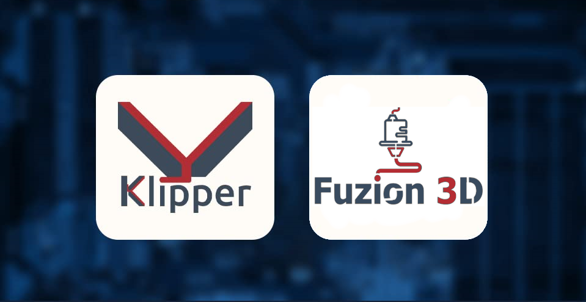

# Klipper en tu impresora 3D,..!!

## 📌 Descripción
Bienvenido a este repositorio de configuraciones **.cfg** para impresoras 3D. Aquí encontrarás archivos de configuración optimizados para diferentes modelos, firmwares y necesidades de impresión. Cada archivo ha sido probado para garantizar estabilidad y rendimiento en la impresión.

## 🛠️ ¿Qué encontrarás aquí?
🔹 Archivos **.cfg** para distintas impresoras 3D y firmwares.

🔹 Configuraciones optimizadas para mejorar la calidad de impresión.

🔹 Ajustes específicos para distintos materiales y velocidades.

🔹 Documentación para facilitar la implementación.

 ## 🛠️ Descripcion del siguiente listado LEER

🔹 **ARCHIVO**: Archivos **.cfg** para distintas impresoras 3D, estos deben ser renombrado a "printer.cfg" y colocarlos en su lugar

🔹 **MAQUINA**: Nombre y modelo de maquina, guiate con esto para encontrar tu maquina

🔹 **IMAGEN**: Imagen ilustrativa, puedes guiarte con la imagen para saber sobre tu maquina.

🔹 **FIRMWARE**: Archivos de flasheo, estos archivos (.bin/.hex) deben ser flasheados a la impresora

| ARCHIVO | MAQUINA | IMAGEN | FIRMWARE |
|---------|--------|----------|--------------|
| [`Descarga CFG`](CFG/printer-anet-a8-2017.cfg) | Anet A8 2017 |  |
| [`Descarga CFG`](CFG/printer-adimlab-2018.cfg) | Adimlab 2018 |  | 
| [`Descarga CFG`](CFG/printer-alfawise-u30-2018.cfg) | AlfaWise U30 |  |
| [`Descarga CFG`](CFG/printer-anet-a4-2018.cfg) | Anet A4 |  |
| [`Descarga CFG`](CFG/printer-anet-a8-2019.cfg) | Anet A8 2019 |  |
| [`Descarga CFG`](CFG/printer-anet-e10-2018.cfg) | Anet E10 |  |
| [`Descarga CFG`](CFG/printer-anet-e16-2019.cfg) | Anet E16 2019 |  |
| [`Descarga CFG`](CFG/printer-anycubic-4max-2018.cfg) | Anycubic 4Max 2018 |  |
| [`Descarga CFG`](CFG/printer-anycubic-4maxpro-2.0-2021.cfg) | Anycubic 4Max Pro 2.0 2021 |  |
| [`Descarga CFG`](CFG/anycubic-kobra-max-trygorilla.cfg) | Anycubic Kobra Max Trygorilla |  |  [`Descarga Firmware.bin`](Firmware/anycubic-kobra-max-trygorilla.bin) 
| [`Descarga CFG`](CFG/printer-anycubic-i3-mega-2017.cfg) | I3 Mega 2017 |  |
| [`Descarga CFG`](CFG/printer-anycubic-kobra-go-2022.cfg) | Anycubyc Kobra Go |  |
| [`Descarga CFG`](CFG/printer-anycubic-kobra-plus-2022.cfg) | Anycubyc Kobra Plus |  |
| [`Descarga CFG`](CFG/printer-anycubic-kossel-2016.cfg) | Anycubic Kossel 2016 |  |
| [`Descarga CFG`](CFG/printer-anycubic-kossel-plus-2017.cfg) | Anycubic Kossel Plus |  |
| [`Descarga CFG`](CFG/printer-anycubic-vyper-2021.cfg) | Anycubic Vyper |  |
| [`Descarga CFG`](CFG/printer-artillery-genius-pro-2022.cfg) | Artillery Genius Pro |  |
| [`Descarga CFG`](CFG/artillery_hornet_cfg.cfg) | Artillery Hornet |  |  [`Descarga Firmware.bin`](Firmware/artilleryhornet.bin)
| [`Descarga CFG`](CFG/printer-artillery-sidewinder-x2-2022.cfg) | Artillery SW x2 |  |
| [`Descarga CFG`](CFG/printer-artillery-sidewinder-x3-plus-2024.cfg) | Artillery SD X3 Plus |  |
| [`Descarga CFG`](CFG/printer-biqu-bx-2021.cfg) | Biqu BX |  |
| [`Descarga CFG`](CFG/printer-bq-hephestos-2014.cfg) | BQ Prusa i3 Hephestos |  |
| [`Descarga CFG`](CFG/printer-creality-cr10-2017.cfg) | Creality CR-10 |  |
| [`Descarga CFG`](CFG/printer-creality-cr10-smart-pro-2022.cfg) | Creality CR-10 Smart Pro |  |
| [`Descarga CFG`](CFG/printer-creality-cr10-v3-2020.cfg) | Creality CR-10 V3 |  |
| [`Descarga CFG`](CFG/printer-creality-cr10mini-2017.cfg) | Creality CR-10 mini |  |
| [`Descarga CFG`](CFG/printer-creality-cr10s-2017.cfg) | Creality CR-10S |  |
| [`Descarga CFG`](CFG/printer-creality-cr10s-pro-v2-2020.cfg) | CR-10S Pro V2 |  |
| [`Descarga CFG`](CFG/printer-creality-cr20-2018.cfg) | Creality CR-20 |  |
| [`Descarga CFG`](CFG/printer-creality-cr20-pro-2019.cfg) | Creality CR-20 Pro |  |
| [`Descarga CFG`](CFG/printer-creality-cr30-2021.cfg) | Creality CR-30 PrintMill |  |
| [`Descarga CFG`](CFG/printer-creality-cr5pro-ht-2022.cfg) | Creality CR5 Pro HT |  |
| [`Descarga CFG`](CFG/printer-creality-cr6se-2020.cfg) | Creality CR6-SE 2020 |  |
| [`Descarga CFG`](CFG/printer-creality-cr6se-2021.cfg) | Creality CR6-SE 2021 |  |
| [`Descarga CFG`](CFG/printer-creality-ender2-2017.cfg) | Creality Ender 2 |  |
| [`Descarga CFG`](CFG/printer-creality-ender2pro-2021.cfg) | Creality Ender 2 Pro |  |
| [`Descarga CFG`](CFG/printer-creality-ender2pro-hc32-2022.cfg) | Creality Ender 2 Pro HC32F460 |  |
| [`Descarga CFG`](CFG/printer-creality-ender3-2018.cfg) | Creality Ender 3 2018 |  |
| [`Descarga CFG`](CFG/printer-creality-ender3-s1-2021.cfg) | Creality Ender 3 S1 |  |
| [`Descarga CFG`](CFG/printer-creality-ender3-v2-2020.cfg) | Creality Ender 3 V2 |  |  [`Descarga Firmware.bin`](Firmware/FIRMWAREender3v2.bin)
| [`Descarga CFG`](CFG/printer-creality-ender3-s1plus-2022.cfg) | Ender 3 S1 Plus |  |  [`pronto`](pronto)
| [`Descarga CFG`](CFG/printer-creality-ender3-v2-neo-2022.cfg) | Ender 3 V2 Neo |  |  [`Descarga Firmware.bin`](Firmware/firmwarev2neo.bin)
| [`Descarga CFG`](CFG/printer-creality-ender3max-2021.cfg) | Ender 3 Max |  |  [`pronto`](pronto)
| [`Descarga CFG`](CFG/printer-creality-ender3pro-2020.cfg) | Ender 3 Pro |  |  [`pronto`](pronto)
| [`Descarga CFG`](CFG/printer_hellbot_magna_se_32.cfg) | Hellbot Magna SE 32 Bits |  |  [`Descarga Firmware 1`](Firmware/hellbot_m_se_32.bin)[`Descarga Firmware 2`](Firmware/hellbot_m_se_32_2.bin)
| [`Descarga CFG`](CFG/printer-creality-ender5-2019.cfg) | Ender 5 |  |  [`pronto`](pronto)
| [`Descarga CFG`](CFG/printer-creality-ender5-s1-2023.cfg) | Ender 5 s1 |  |  [`pronto`](pronto)
| [`Descarga CFG`](CFG/printer-creality-ender5plus-2019.cfg) | Ender 5 Plus |  |  [`pronto`](pronto)
| [`Descarga CFG`](CFG/printer-creality-ender5pro-2020.cfg) | Ender 5 Pro |  | [`Descarga Firmware`](Firmware/ender5pro.bin)
| [`Descarga CFG`](CFG/printer-creality-ender6-2020.cfg) | Ender 6 |  | [`Descarga Firmware`](Firmware/ender6.bin)
| [`Descarga CFG`](CFG/printer-creality-sermoonD1-2021.cfg) | Sermoon D1 |  |  [`Descarga Firmware`](Firmware/Sermoon_D1.bin)

## 🔧 ¿Cómo usar estos archivos?  

1. Descarga el archivo **.cfg** correspondiente a tu impresora.  
2. Cópialo en **Mainsail/Fluidd** → `printer.cfg`  
3. Modifica los parámetros según tus necesidades específicas.  
4. Sube el archivo a tu impresora y reinicia.  

## 📜 Licencia
Este proyecto está bajo la licencia **MIT**, lo que significa que puedes usar, modificar y distribuir estos archivos libremente. 🔓

🚀 ¡Feliz impresión! 🎨🔥

DISCLAIMER  

  
El presente repositorio tiene como propósito proporcionar documentación y guías para la instalación, configuración y uso del software Klipper en impresoras 3D. El uso de este repositorio y el software Klipper están sujetos a las siguientes condiciones:  

**1. Uso bajo su propio riesgo:**  
La instalación y el uso del software Klipper son realizados bajo el propio riesgo del usuario. El propietario de este repositorio no asume ninguna responsabilidad por daños directos, indirectos, incidentales, especiales o consecuentes, incluidos, entre otros, la pérdida de datos, daños al hardware, o cualquier otra pérdida derivada del uso o la imposibilidad de uso del software.  

**2. Precauciones y riesgos asociados:**  
La instalación y configuración incorrecta de Klipper pueden resultar en la pérdida de funcionalidad o daños permanentes en el hardware de la impresora 3D o dispositivos asociados. El usuario debe verificar la compatibilidad de su hardware y software antes de proceder con la instalación.  

**3. Compatibilidad:**  
Este repositorio no garantiza que Klipper sea compatible con todas las impresoras 3D, controladores o plataformas. La responsabilidad de verificar la compatibilidad y la funcionalidad del software recae en el usuario. El propietario de este repositorio no proporciona soporte técnico directo.  

**4. Modificaciones y personalizaciones:**  
El usuario tiene la libertad de modificar y personalizar el software Klipper bajo su propia responsabilidad. Cualquier modificación o alteración del software o hardware que cause fallos en el funcionamiento, daños a los dispositivos o pérdida de datos es responsabilidad exclusiva del usuario.  

**5. No se proporciona soporte:**  
El propietario de este repositorio no proporciona soporte técnico, asistencia o asesoría directa para la instalación o uso del software Klipper. Cualquier problema técnico debe ser resuelto a través de los canales oficiales de soporte de Klipper o mediante la consulta de foros y comunidades especializadas.  

**6. Exclusión de garantías:**  
Klipper y el contenido de este repositorio se proporcionan "tal cual", sin ninguna garantía expresa o implícita de ningún tipo, incluyendo, pero no limitándose a, 

